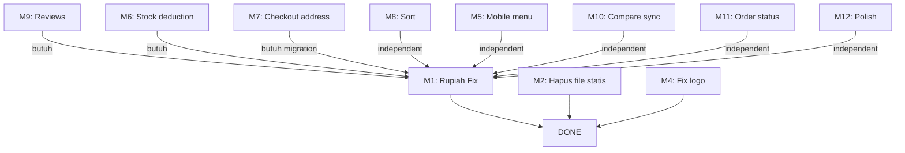

# PLAN REVISI — ZLM-ID

> **Versi**: Detail untuk Tim Engineering  
> **Target**: Semua perbaikan siap eksekusi oleh Builder Agent  
> **Format setiap task**: `[FILE]` → `[Baris]` → `[Kode Sebelum]` → `[Kode Sesudah]`

---

## 🏗️ MODUL 1: RUPIAH CURRENCY (A.1)

### Task 1.1 — Cart: Subtotal & Total
**File**: `resources/views/cart/index.blade.php`

**1.1.a** — Baris 37: Subtotal per item
```
SEBELUM:  <p class="text-base font-medium text-[#363230] w-24 text-right">\${{ number_format(\$item->subtotal, 2) }}</p>
SESUDAH:  <p class="text-base font-medium text-[#363230] w-24 text-right">Rp {{ number_format(\$item->subtotal, 0, ',', '.') }}</p>
```

**1.1.b** — Baris 54: Total cart
```
SEBELUM:  <span class="text-2xl font-semibold text-[#363230]">\${{ number_format(\$cart->total, 2) }}</span>
SESUDAH:  <span class="text-2xl font-semibold text-[#363230]">Rp {{ number_format(\$cart->total, 0, ',', '.') }}</span>
```

---

### Task 1.2 — Orders Checkout: Semua harga
**File**: `resources/views/orders/checkout.blade.php`

**1.2.a** — Baris 33: Subtotal per item
```
SEBELUM:  <p class="font-medium text-[#363230]">\${{ number_format(\$item->subtotal, 2) }}</p>
SESUDAH:  <p class="font-medium text-[#363230]">Rp {{ number_format(\$item->subtotal, 0, ',', '.') }}</p>
```

**1.2.b** — Baris 58: Subtotal
```
SEBELUM:  <span class="font-medium text-[#363230]">\${{ number_format(\$subtotal, 2) }}</span>
SESUDAH:  <span class="font-medium text-[#363230]">Rp {{ number_format(\$subtotal, 0, ',', '.') }}</span>
```

**1.2.c** — Baris 62: Tax
```
SEBELUM:  <span class="font-medium text-[#363230]">\${{ number_format(\$tax, 2) }}</span>
SESUDAH:  <span class="font-medium text-[#363230]">Rp {{ number_format(\$tax, 0, ',', '.') }}</span>
```

**1.2.d** — Baris 66: Total
```
SEBELUM:  <span class="text-xl font-semibold text-[#363230]">\${{ number_format(\$total, 2) }}</span>
SESUDAH:  <span class="text-xl font-semibold text-[#363230]">Rp {{ number_format(\$total, 0, ',', '.') }}</span>
```

---

### Task 1.3 — Order Confirmation
**File**: `resources/views/orders/confirmation.blade.php`

**1.3.a** — Baris 30: Total
```
SEBELUM:  <span class="text-lg font-semibold text-[#363230]">\${{ number_format(\$order->total, 2) }}</span>
SESUDAH:  <span class="text-lg font-semibold text-[#363230]">Rp {{ number_format(\$order->total, 0, ',', '.') }}</span>
```

---

### Task 1.4 — Order History
**File**: `resources/views/orders/history.blade.php`

**1.4.a** — Baris 26: Total per order
```
SEBELUM:  <p class="text-lg font-semibold text-[#363230] mt-2">\${{ number_format(\$order->total, 2) }}</p>
SESUDAH:  <p class="text-lg font-semibold text-[#363230] mt-2">Rp {{ number_format(\$order->total, 0, ',', '.') }}</p>
```

---

### Task 1.5 — Search Page: Price Filter Placeholder
**File**: `resources/views/landing/search.blade.php`

**1.5.a** — Baris 75: Min price placeholder
```
SEBELUM:  <input type="number" name="min_price" placeholder="Min \$" ...>
SESUDAH:  <input type="number" name="min_price" placeholder="Min Rp" ...>
```

**1.5.b** — Baris 77: Max price placeholder
```
SEBELUM:  <input type="number" name="max_price" placeholder="Max \$" ...>
SESUDAH:  <input type="number" name="max_price" placeholder="Max Rp" ...>
```

**1.5.c** — Baris 79: Max limit text
```
SEBELUM:  <p class="text-xs text-gray-400">Max limit: \${{ number_format(\$maxPrice, 0) }}</p>
SESUDAH:  <p class="text-xs text-gray-400">Max: Rp {{ number_format(\$maxPrice, 0, ',', '.') }}</p>
```

---

### Task 1.6 — Detail Page: USD Label & Variant Price JS
**File**: `resources/views/landing/detail.blade.php`

**1.6.a** — Baris 118: Hapus label "USD"
```
SEBELUM:  <span class="text-sm text-gray-400">USD</span>
SESUDAH:  <span class="text-sm text-gray-400"></span>  {{-- atau hapus baris ini --}}
```

**1.6.b** — Baris 183: JS variant price update
```
SEBELUM:  document.querySelector('.text-4xl').textContent = '\$' + price;
SESUDAH:  document.querySelector('.text-4xl').textContent = 'Rp ' + new Intl.NumberFormat('id-ID').format(price);
```

**1.6.c** — Baris 143: Data attribute price variant juga pakai format Rp
```
SEBELUM:  data-price="{{ number_format(\$laptop->price + \$variant->price_modifier, 2) }}"
SESUDAH:  data-price="{{ \$laptop->price + \$variant->price_modifier }}"
```
> Catatan: data-price simpan angka mentah, formatting dilakukan di JS

---

### Task 1.7 — Admin Dashboard Revenue
**File**: `resources/views/admin/dashboard.blade.php`

**1.7.a** — Baris 68
```
SEBELUM:  <div class="text-2xl font-medium tracking-tight text-[#363230] mb-2 relative z-10">\$0.00</div>
SESUDAH:  <div class="text-2xl font-medium tracking-tight text-[#363230] mb-2 relative z-10">Rp 0</div>
```
> Catatan: ini akan diganti dengan data dinamis nanti, untuk sekarang jadi Rp 0

---

## 🏗️ MODUL 2: LANDING CHECKOUT (A.2)

### Task 2.1 — Hapus File Tidak Dipakai
**Aksi**: Hapus file `resources/views/landing/checkout.blade.php`
```
Command: Remove-Item -LiteralPath "resources/views/landing/checkout.blade.php"
```

### Task 2.2 — Redirect Route ke Orders Checkout
**File**: `routes/web.php`

Cari route `landing.checkout` (baris 43):
```
SEBELUM:  Route::get('/checkout', [OrderController::class, 'checkout'])->name('landing.checkout');
SESUDAH:  Route::get('/checkout', [OrderController::class, 'checkout'])->name('landing.checkout');
```
> Tidak perlu diubah — OrderController@checkout sudah menggunakan view `orders.checkout`.
> TAPI pastikan view `orders/checkout.blade.php` yang dipakai benar-benar fungsional.

### Task 2.3 — Fix orders/checkout: Pastikan form wrapping address
**File**: `resources/views/orders/checkout.blade.php`
- Periksa apakah form action `route('orders.place')` membungkus semua input (address + payment)
- Jika tidak, pindahkan `</form>` ke bagian paling bawah

---

## 🏗️ MODUL 3: LANDING PROFILE (A.3)

### Task 3.1 — Hapus File Tidak Dipakai
**Aksi**: Hapus file `resources/views/landing/profile.blade.php`
```
Command: Remove-Item -LiteralPath "resources/views/landing/profile.blade.php"
```

### Task 3.2 — Redirect landing.profile ke profile.edit
**File**: `routes/web.php`

Baris 47:
```
SEBELUM:  Route::get('/profile', [ProfileController::class, 'edit'])->name('profile.edit');
SESUDAH:  // Profile route sudah ada di bawah middleware auth, tidak perlu diubah
```
> Route `profile.edit` sudah benar menggunakan `profile.edit` view dari Breeze.
> Pastikan tidak ada route `landing.profile` yang mengarah ke view `landing.profile`

---

## 🏗️ MODUL 4: ADMIN SIDEBAR LOGO (A.4)

### Task 4.1 — Ganti Logo
**File**: `resources/views/layouts/admin.blade.php`

Baris 32-34:
```
SEBELUM:  <a href="{{ route('landing.home') }}" class="text-xl font-medium tracking-tighter text-[#363230]">
              SYS<span class="text-[#DF5E1D]">TM</span>
          </a>
SESUDAH:  <a href="{{ route('landing.home') }}" class="text-xl font-medium tracking-tighter text-[#363230] flex items-center gap-2">
              
              ZLM<span class="text-[#DF5E1D]">.ID</span>
          </a>
```

---

## 🏗️ MODUL 5: REVIEW DI DETAIL PRODUK (B.3)

### Task 5.1 — Controller: Load reviews
**File**: `app/Http/Controllers/LaptopController.php`

Baris 57-71 (`show` method):
```
SEBELUM:  public function show($id)
          {
              $laptop = Laptop::with('categories', 'variants')->findOrFail($id);
              $categoryIds = $laptop->categories->pluck('id');
              $similar = Laptop::whereHas('categories', ...)->get();
              return view('landing.detail', compact('laptop', 'similar'));
          }

SESUDAH:  public function show($id)
          {
              $laptop = Laptop::with('categories', 'variants', 'reviews.user')->findOrFail($id);
              $categoryIds = $laptop->categories->pluck('id');
              $similar = Laptop::whereHas('categories', ...)->get();
              $reviews = $laptop->reviews()->with('user')->latest()->paginate(10);
              return view('landing.detail', compact('laptop', 'similar', 'reviews'));
          }
```

### Task 5.2 — View: Tambah section Reviews
**File**: `resources/views/landing/detail.blade.php`

**5.2.a** — Tambahkan setelah section "Similar Laptops" (sebelum `</div>` baris 412):

```blade
{{-- Reviews Section --}}
@if ($reviews->count() > 0)
<div class="border-t border-gray-200/60 pt-16 lg:pt-20 mb-16">
    <h2 class="text-2xl font-medium tracking-tight text-[#363230] mb-10">Customer Reviews</h2>
    <div class="space-y-6">
        @foreach ($reviews as $review)
        <div class="bg-white rounded-2xl border border-gray-200/60 shadow-sm p-6">
            <div class="flex items-start gap-4">
                <div class="w-10 h-10 rounded-full bg-gray-100 flex items-center justify-center text-sm font-medium text-gray-600">
                    {{ strtoupper(substr($review->user->name ?? 'U', 0, 1)) }}
                </div>
                <div class="flex-1">
                    <div class="flex items-center justify-between mb-1">
                        <p class="text-sm font-semibold text-[#363230]">{{ $review->user->name ?? 'Anonymous' }}</p>
                        <span class="text-xs text-gray-400">{{ $review->created_at->diffForHumans() }}</span>
                    </div>
                    <div class="flex text-amber-400 text-sm mb-2">
                        @for ($i = 1; $i <= 5; $i++)
                            <iconify-icon icon="{{ $i <= $review->rating ? 'solar:star-bold' : 'solar:star-linear' }}"></iconify-icon>
                        @endfor
                    </div>
                    <p class="text-sm text-gray-600">{{ $review->comment }}</p>
                </div>
            </div>
        </div>
        @endforeach
    </div>
    @if ($reviews->hasPages())
    <div class="mt-8">{{ $reviews->links() }}</div>
    @endif
</div>
@endif

{{-- Review Form --}}
@auth
<div class="border-t border-gray-200/60 pt-16 lg:pt-20 mb-16">
    <h2 class="text-2xl font-medium tracking-tight text-[#363230] mb-6">Write a Review</h2>
    <form method="POST" action="{{ route('reviews.store', $laptop) }}" class="bg-white rounded-2xl border border-gray-200/60 shadow-sm p-6 space-y-4">
        @csrf
        <div>
            <label class="block text-sm font-medium text-gray-700 mb-2">Rating</label>
            <div class="flex gap-1 text-2xl" id="rating-stars">
                @for ($i = 1; $i <= 5; $i++)
                    <button type="button" onclick="setRating({{ $i }})" class="text-gray-300 hover:text-amber-400 transition-colors rating-star" data-value="{{ $i }}">
                        <iconify-icon icon="solar:star-linear"></iconify-icon>
                    </button>
                @endfor
            </div>
            <input type="hidden" name="rating" id="rating-input" value="5">
        </div>
        <div>
            <label class="block text-sm font-medium text-gray-700 mb-2">Review</label>
            <textarea name="comment" rows="4" required class="w-full px-4 py-2.5 bg-gray-50 border border-gray-200 rounded-xl text-sm focus:outline-none focus:ring-2 focus:ring-[#DF5E1D]/20 focus:border-[#DF5E1D] transition-all" placeholder="Share your experience..."></textarea>
        </div>
        <button type="submit" class="bg-[#DF5E1D] text-white px-6 py-2.5 rounded-xl text-sm font-medium hover:bg-[#c45218] transition-colors">
            Submit Review
        </button>
    </form>
</div>

<script>
function setRating(val) {
    document.getElementById('rating-input').value = val;
    document.querySelectorAll('.rating-star').forEach((star, i) => {
        const icon = star.querySelector('iconify-icon');
        if (i < val) {
            icon.setAttribute('icon', 'solar:star-bold');
            star.classList.add('text-amber-400');
            star.classList.remove('text-gray-300');
        } else {
            icon.setAttribute('icon', 'solar:star-linear');
            star.classList.remove('text-amber-400');
            star.classList.add('text-gray-300');
        }
    });
}
</script>
@else
<div class="border-t border-gray-200/60 pt-16 lg:pt-20 mb-16 text-center">
    <p class="text-sm text-gray-500">
        <a href="{{ route('login') }}" class="text-[#DF5E1D] hover:underline">Login</a> to write a review.
    </p>
</div>
@endauth
```

---

## 🏗️ MODUL 6: STOCK DEDUCTION (B.7)

### Task 6.1 — Update OrderController
**File**: `app/Http/Controllers/OrderController.php`

**6.1.a** — Di method `placeOrder`, setelah validasi cart (sebelum create order), tambahkan:

```php
// Validasi stock
foreach ($cart->items as $item) {
    $laptop = $item->laptop;
    if ($laptop->stock < $item->quantity) {
        return redirect()->back()->with('error', "Insufficient stock for {$laptop->name}.");
    }
    if ($item->variant && $item->variant->stock < $item->quantity) {
        return redirect()->back()->with('error', "Insufficient stock for variant {$item->variant->name}.");
    }
}
```

**6.1.b** — Setelah order items dibuat (setelah line 58), tambahkan:

```php
// Kurangi stock
foreach ($cart->items as $item) {
    $laptop = $item->laptop;
    $laptop->decrement('stock', $item->quantity);
    if ($item->variant) {
        $item->variant->decrement('stock', $item->quantity);
    }
}
```

---

## 🏗️ MODUL 7: CHECKOUT ADDRESS + FORM INTEGRATION (B.5 + B.8)

### Task 7.1 — Migration: Add address fields to orders
**File baru**: `database/migrations/YYYY_MM_DD_HHMMSS_add_address_to_orders_table.php`

```php
Schema::table('orders', function (Blueprint $table) {
    $table->string('shipping_address')->nullable()->after('notes');
    $table->string('shipping_city')->nullable()->after('shipping_address');
    $table->string('shipping_province')->nullable()->after('shipping_city');
    $table->string('shipping_postal_code')->nullable()->after('shipping_province');
    $table->string('shipping_phone')->nullable()->after('shipping_postal_code');
});
```

### Task 7.2 — Model: Add fillable
**File**: `app/Models/Order.php`

Tambah ke `$fillable`:
```php
'shipping_address', 'shipping_city', 'shipping_province', 'shipping_postal_code', 'shipping_phone',
```

### Task 7.3 — View: Integrasi form address ke order
**File**: `resources/views/orders/checkout.blade.php`

Restruktur: Semua input address HARUS di dalam `<form method="POST" action="{{ route('orders.place') }}">`.
- Pindahkan `</form>` dari baris 42 ke setelah button Place Order
- Tambahkan input hidden untuk address fields
- Pastikan global `<form>` membungkus seluruh konten

### Task 7.4 — Controller: Simpan address
**File**: `app/Http/Controllers/OrderController.php`

Tambah di `placeOrder` validasi:
```php
'notes' => 'nullable|string',
'shipping_address' => 'required|string',
'shipping_city' => 'required|string',
'shipping_province' => 'required|string',
'shipping_postal_code' => 'required|string',
'shipping_phone' => 'required|string',
```

Dan di `Order::create()` tambahkan field address.

---

## 🏗️ MODUL 8: SORT DROPDOWN (B.2)

### Task 8.1 — JS Auto-submit sort
**File**: `resources/views/landing/search.blade.php`

Baris 103-113: Tambahkan onchange pada select sort:
```
SEBELUM:  <select class="w-full ...">
              <option>Latest Arrivals</option>
              ...
          </select>
SESUDAH:  <select name="sort" onchange="this.form.submit()" class="w-full ...">
              <option value="latest" @selected(request('sort') == 'latest')>Latest Arrivals</option>
              <option value="price_asc" @selected(request('sort') == 'price_asc')>Price: Low to High</option>
              <option value="price_desc" @selected(request('sort') == 'price_desc')>Price: High to Low</option>
              <option value="popular" @selected(request('sort') == 'popular')>Most Popular</option>
          </select>
```

> Catatan: Select ini harus di DALAM `<form>` yang membungkus filter, atau buat form terpisah.

### Task 8.2 — Controller: Implement sort logic
**File**: `app/Http/Controllers/LaptopController.php`

Di method `search()`, sebelum `$query->paginate(12)`:
```php
// Sort
if ($request->has('sort')) {
    match ($request->sort) {
        'price_asc' => $query->orderBy('price'),
        'price_desc' => $query->orderBy('price', 'desc'),
        'popular' => $query->orderBy('name'), // placeholder — nanti bisa ganti dengan review count
        default => $query->latest(),
    };
} else {
    $query->latest();
}
```

---

## 🏗️ MODUL 9: MOBILE MENU (B.1)

### Task 9.1 — Tambah off-canvas mobile menu
**File**: `resources/views/components/landing-nav.blade.php`

Setelah baris 89 (sebelum `</nav>`), tambahkan:

```blade
{{-- Mobile Menu Overlay --}}
<div id="mobile-menu" class="fixed inset-0 z-50 hidden">
    <div class="absolute inset-0 bg-black/40 backdrop-blur-sm" onclick="toggleMobileMenu()"></div>
    <div class="absolute left-0 top-0 bottom-0 w-72 bg-white shadow-2xl overflow-y-auto">
        <div class="flex items-center justify-between p-4 border-b border-gray-100">
            <a href="{{ route('landing.home') }}" class="text-[#363230] text-xl font-semibold tracking-tighter">ZLM.ID</a>
            <button onclick="toggleMobileMenu()" class="p-2 text-gray-500 hover:text-gray-800">
                <iconify-icon icon="solar:close-circle-linear" class="text-2xl"></iconify-icon>
            </button>
        </div>
        <div class="p-4 space-y-2">
            <a href="{{ route('landing.home') }}" class="block px-4 py-3 rounded-xl text-sm font-medium text-gray-700 hover:bg-gray-50 hover:text-[#DF5E1D] transition-colors">Beranda</a>
            <a href="{{ route('landing.search') }}" class="block px-4 py-3 rounded-xl text-sm font-medium text-gray-700 hover:bg-gray-50 hover:text-[#DF5E1D] transition-colors">Katalog</a>
            <a href="{{ route('landing.articles') }}" class="block px-4 py-3 rounded-xl text-sm font-medium text-gray-700 hover:bg-gray-50 hover:text-[#DF5E1D] transition-colors">Artikel</a>
            <a href="{{ route('landing.compare') }}" class="block px-4 py-3 rounded-xl text-sm font-medium text-gray-700 hover:bg-gray-50 hover:text-[#DF5E1D] transition-colors">Bandingkan</a>
            <a href="{{ route('cart.index') }}" class="block px-4 py-3 rounded-xl text-sm font-medium text-gray-700 hover:bg-gray-50 hover:text-[#DF5E1D] transition-colors">Keranjang</a>
            @auth
            <hr class="my-2">
            <a href="{{ route('profile.edit') }}" class="block px-4 py-3 rounded-xl text-sm font-medium text-gray-700 hover:bg-gray-50 hover:text-[#DF5E1D] transition-colors">Profile</a>
            <a href="{{ route('wishlist.index') }}" class="block px-4 py-3 rounded-xl text-sm font-medium text-gray-700 hover:bg-gray-50 hover:text-[#DF5E1D] transition-colors">Wishlist</a>
            @role('admin')
            <a href="{{ route('admin.dashboard') }}" class="block px-4 py-3 rounded-xl text-sm font-medium text-[#DF5E1D] hover:bg-orange-50 transition-colors">Dashboard Admin</a>
            @endrole
            @else
            <hr class="my-2">
            <a href="{{ route('login') }}" class="block px-4 py-3 rounded-xl text-sm font-medium bg-[#DF5E1D] text-white text-center hover:bg-[#c45218] transition-colors">Sign In</a>
            @endauth
        </div>
    </div>
</div>

<script>
function toggleMobileMenu() {
    document.getElementById('mobile-menu').classList.toggle('hidden');
}
</script>
```

**Update**: Tombol hamburger baris 84-88:
```
SEBELUM:  <button class="text-[#363230] hover:opacity-70 transition">
              <iconify-icon icon="solar:menu-dots-bold" class="text-2xl"></iconify-icon>
          </button>
SESUDAH:  <button onclick="toggleMobileMenu()" class="text-[#363230] hover:opacity-70 transition">
              <iconify-icon icon="solar:menu-dots-bold" class="text-2xl"></iconify-icon>
          </button>
```

---

## 🏗️ MODUL 10: COMPARE SYNC (B.6)

### Task 10.1 — Standardisasi: Pakai Session untuk Compare
**Aksi**: Ubah semua referensi compare di frontend dari localStorage ke session via API.

**File**: `resources/views/landing/home.blade.php`

Line 105: Ubah JS function `addToCompare`:
```js
function addToCompare(laptopId) {
    fetch('{{ route('compare.add') }}', {
        method: 'POST',
        headers: { 'Content-Type': 'application/json', 'X-CSRF-TOKEN': '{{ csrf_token() }}' },
        body: JSON.stringify({ laptop_id: laptopId }),
    })
    .then(r => r.json())
    .then(res => {
        if (res.success) {
            showToast('Ditambahkan ke perbandingan', 'success');
            updateCompareBadge();
        } else {
            showToast(res.message, 'info');
        }
    });
}
```

**File**: `resources/views/landing/search.blade.php`
- Ubah `addToCompare` function yang ada (line ~184) dengan implementasi fetch ke route `compare.add`
- Hapus referensi `localStorage` untuk compare

**File**: `resources/views/landing/detail.blade.php`
- Ubah `addToCompare` function (line 458-473) dengan fetch ke route `compare.add`

**Update floating-compare badge**: Pastikan semua badge membaca dari server response, bukan localStorage.

---

## 🏗️ MODUL 11: ADMIN ORDER STATUS (B.9)

### Task 11.1 — Route: Add status update
**File**: `routes/web.php`

Tambahkan di dalam group admin (setelah line 69):
```php
Route::patch('/orders/{order}/status', [App\Http\Controllers\Admin\OrderStatusController::class, 'update'])->name('orders.status');
```

### Task 11.2 — Controller: OrderStatusController
**File baru**: `app/Http/Controllers/Admin/OrderStatusController.php`

```php
<?php
namespace App\Http\Controllers\Admin;

use App\Http\Controllers\Controller;
use App\Models\Order;
use Illuminate\Http\Request;

class OrderStatusController extends Controller
{
    public function update(Request $request, Order $order)
    {
        $data = $request->validate([
            'status' => 'required|in:pending,processing,shipped,delivered,cancelled',
        ]);

        $order->update($data);

        return redirect()->back()->with('success', "Order status updated to {$data['status']}.");
    }
}
```

### Task 11.3 — View: Tambah tombol status
**File**: `resources/views/admin/orders/index.blade.php`

Tambah kolom "Actions" setelah kolom "Status" (sebelum kolom Date, atau setelah Status column):
```blade
<td class="py-4 px-6">
    <form method="POST" action="{{ route('admin.orders.status', $order) }}" class="flex gap-1">
        @csrf
        @method('PATCH')
        <select name="status" onchange="this.form.submit()" class="text-xs bg-gray-50 border border-gray-200 rounded-lg px-2 py-1">
            <option value="pending" @selected($order->status == 'pending')>Pending</option>
            <option value="processing" @selected($order->status == 'processing')>Processing</option>
            <option value="shipped" @selected($order->status == 'shipped')>Shipped</option>
            <option value="delivered" @selected($order->status == 'delivered')>Delivered</option>
            <option value="cancelled" @selected($order->status == 'cancelled')>Cancelled</option>
        </select>
    </form>
</td>
```

Update jumlah kolom colspan di empty state + table head.

---

## 🏗️ MODUL 12: POLISH (C)

### Task 12.1 — Footer Enhancement (C.1)
**File**: `resources/views/components/landing-footer.blade.php`

Perluas dengan:
```blade
<footer class="bg-[#2a2725] pt-12 pb-8 border-t border-white/5">
    <div class="max-w-7xl mx-auto px-4 sm:px-6 lg:px-8">
        <div class="grid grid-cols-1 md:grid-cols-3 gap-8 mb-8">
            <div>
                <h4 class="text-white font-semibold mb-3">ZLM.ID</h4>
                <p class="text-xs text-gray-500 leading-relaxed">Premium laptop store — engineered excellence for professionals, creators, and gamers.</p>
            </div>
            <div>
                <h4 class="text-white font-semibold mb-3">Links</h4>
                <ul class="space-y-2 text-xs text-gray-500">
                    <li><a href="{{ route('landing.search') }}" class="hover:text-[#DF5E1D] transition-colors">Katalog</a></li>
                    <li><a href="{{ route('landing.articles') }}" class="hover:text-[#DF5E1D] transition-colors">Artikel</a></li>
                </ul>
            </div>
            <div>
                <h4 class="text-white font-semibold mb-3">Contact</h4>
                <ul class="space-y-2 text-xs text-gray-500">
                    <li>Email: support@zlm.id</li>
                    <li>Phone: +62 123 4567 8910</li>
                </ul>
            </div>
        </div>
        <div class="pt-8 border-t border-white/5 text-center">
            <p class="text-xs text-gray-500">© {{ date('Y') }} ZLM.ID. All rights reserved.</p>
        </div>
    </div>
</footer>
```

### Task 12.2 — Admin Mobile Sidebar (C.4)
**File**: `resources/views/layouts/admin.blade.php`

Baris 88: Tambahkan onclick handler untuk tombol hamburger:
```
SEBELUM:  <button class="lg:hidden p-2 -ml-2 text-gray-500 hover:bg-gray-50 rounded-xl transition-colors">
SESUDAH:  <button onclick="document.getElementById('admin-sidebar').classList.toggle('hidden')" class="lg:hidden p-2 -ml-2 text-gray-500 hover:bg-gray-50 rounded-xl transition-colors">
```

Tambahkan id di aside (baris 30):
```
SEBELUM:  <aside class="w-64 hidden lg:flex flex-col...">
SESUDAH:  <aside id="admin-sidebar" class="w-64 hidden lg:flex flex-col fixed lg:relative inset-y-0 left-0 z-30...">
```

---

## 📋 RINGKASAN SEMUA TASK

| # | Modul | Task | File Utama | Builder |
|---|-------|------|-----------|---------|
| 1 | A.1 | Rupiah Cart | `cart/index.blade.php` | BUILDER-A |
| 2 | A.1 | Rupiah Orders | `orders/*.blade.php` (3 file) | BUILDER-A |
| 3 | A.1 | Rupiah Search | `landing/search.blade.php` | BUILDER-A |
| 4 | A.1 | Rupiah Detail | `landing/detail.blade.php` | BUILDER-A |
| 5 | A.1 | Rupiah Dashboard | `admin/dashboard.blade.php` | BUILDER-A |
| 6 | A.2 | Hapus landing checkout | `landing/checkout.blade.php` | BUILDER-B |
| 7 | A.3 | Hapus landing profile | `landing/profile.blade.php` | BUILDER-B |
| 8 | A.4 | Fix admin logo | `layouts/admin.blade.php` | BUILDER-B |
| 9 | B.3 | Reviews di detail | `landing/detail.blade.php`, `LaptopController.php` | BUILDER-C |
| 10 | B.7 | Stock deduction | `OrderController.php` | BUILDER-C |
| 11 | B.5+B.8 | Checkout address | `OrderController.php`, `Order.php`, `orders/checkout.blade.php`, migration | BUILDER-D |
| 12 | B.2 | Sort dropdown | `landing/search.blade.php`, `LaptopController.php` | BUILDER-D |
| 13 | B.1 | Mobile menu | `components/landing-nav.blade.php` | BUILDER-E |
| 14 | B.6 | Compare sync | `landing/home.blade.php`, `search.blade.php`, `detail.blade.php` | BUILDER-E |
| 15 | B.9 | Admin order status | `routes/web.php`, controller baru, `admin/orders/index.blade.php` | BUILDER-F |
| 16 | C.1 | Footer | `components/landing-footer.blade.php` | BUILDER-F |
| 17 | C.4 | Admin mobile | `layouts/admin.blade.php` | BUILDER-F |

---

## ⏱️ DEPENDENCY & URUTAN



**Urutan eksekusi**:
1. **M1** (A.1 Rupiah) — PREREQUISITE untuk semua modul lain (biar semua harga seragam)
2. **M2** (A.2 + A.3 Hapus file statis) — bisa paralel dengan M1
3. **M3** (A.4 Fix logo) — bisa paralel
4. **M4-M10** (B.1-B.9, C) — bisa dikerjakan paralel setelah M1 selesai

---

## ✅ DEFINISI "SELESAI" PER MODUL

| Modul | Kriteria Selesai |
|-------|-----------------|
| **M1 Rupiah** | Tidak ada satupun `$` di file Blade — semua harga pakai `Rp` dengan format `number_format(..., 0, ',', '.')` |
| **M2 Hapus Statis** | File `landing/checkout.blade.php` dan `landing/profile.blade.php` dihapus — route tidak error |
| **M3 Logo** | Admin sidebar menampilkan "ZLM.ID" dengan logo |
| **M4 Reviews** | Detail produk menampilkan reviews + form review (untuk user login) |
| **M5 Stock** | Setiap order mengurangi stock laptop & variant |
| **M6 Address** | Order punya shipping address lengkap + tersimpan di DB |
| **M7 Sort** | Dropdown sort mengubah urutan hasil pencarian |
| **M8 Mobile Menu** | Klik hamburger → muncul slide-in menu navigasi |
| **M9 Compare** | Compare menggunakan session (via API) konsisten di semua halaman |
| **M10 Order Status** | Admin bisa ubah status order via dropdown |
| **M11 Footer** | Footer punya 3 kolom: brand info, links, contact |
| **M12 Admin Mobile** | Sidebar bisa di-toggle di layar kecil |
